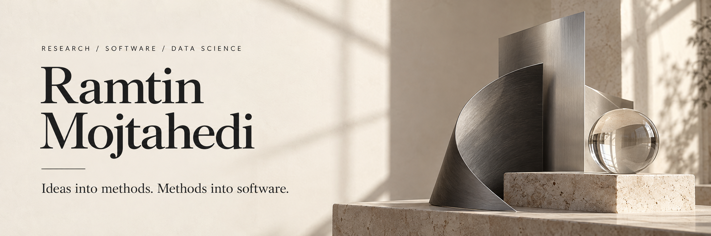
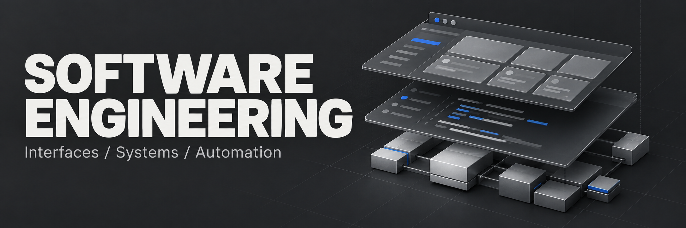
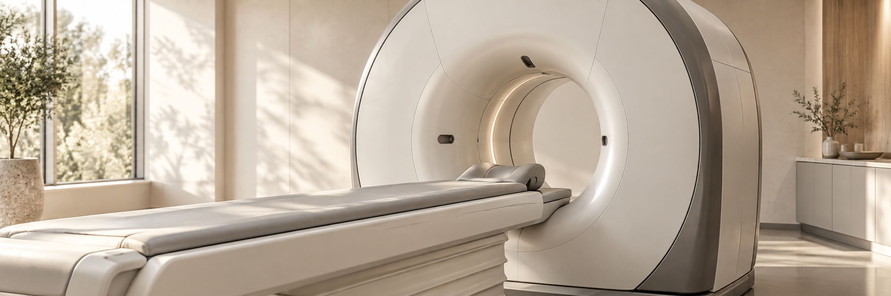
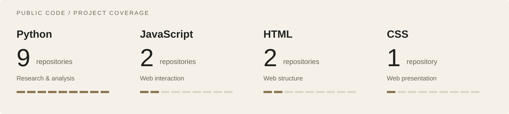

  <a href="https://ramtin-mojtahedi.github.io/"><strong>Portfolio</strong></a> &nbsp; / &nbsp;
  <a href="./REPOSITORY_INDEX.md"><strong>Projects</strong></a> &nbsp; / &nbsp;
  <a href="https://ramtin-mojtahedi.github.io/publications/"><strong>Publications</strong></a> &nbsp; / &nbsp;
  <a href="https://ramtin-mojtahedi.github.io/#contact"><strong>Contact</strong></a>

## Research-minded. Engineering-driven.

I work across **scientific computing, data science, machine learning, and software development**—from computational imaging and analytical workflows to interactive websites and publication tools.

I hold a **Ph.D. in Computing from Queen's University** and am a **postdoctoral researcher at Toronto General Hospital, University Health Network, and the University of Toronto**. My current research explores multimodal prediction of lung-transplant outcomes.

## Explore the work

<table>
  <tr>
    <td width="38%" valign="top"></td>
    <td valign="top">
      <h3>01 / Software &amp; web engineering</h3>
      
Public-facing websites, structured publication data, accessible interaction, and automated validation.

      
<a href="https://github.com/Ramtin-Mojtahedi/Ramtin-Mojtahedi.github.io"><strong>Research portfolio &amp; publishing tools →</strong></a> <a href="https://github.com/Ramtin-Mojtahedi/natasha-singh-dental-site">Dental-profile website concept →</a>

      
<code>JavaScript</code> <code>HTML / CSS</code> <code>Python</code>

    </td>
  </tr>
  <tr>
    <td width="38%" valign="top"></td>
    <td valign="top">
      <h3>02 / Data science &amp; analysis</h3>
      
Feature analysis, statistical learning, model selection, and research notebooks that connect data to questions.

      
<a href="https://github.com/Ramtin-Mojtahedi/AI-Radiomics-Carotid"><strong>Carotid radiomics &amp; cardiovascular risk →</strong></a> <a href="https://github.com/Ramtin-Mojtahedi/Group_Share_Implementation">Model-selection coursework →</a> · <a href="https://github.com/Ramtin-Mojtahedi/Assignment-4---Sentiment-Analysis">Sentiment analysis →</a>

      
<code>pandas</code> <code>scikit-learn</code> <code>XGBoost</code>

    </td>
  </tr>
  <tr>
    <td width="38%" valign="top"></td>
    <td valign="top">
      <h3>03 / Computational imaging &amp; learning</h3>
      
Image segmentation, representation learning, foundation-model adaptation, and learning from limited data.

      
<a href="https://github.com/Ramtin-Mojtahedi/peft-sam-liver-ct"><strong>SAM adaptation for liver CT →</strong></a> <a href="https://github.com/Ramtin-Mojtahedi/PEFT-FSL-MViT-LTS">LoRA &amp; few-shot learning →</a> · <a href="https://github.com/Ramtin-Mojtahedi/SimSiam-LiverCancer-CL">SimSiam representations →</a>

      
<code>PyTorch</code> <code>MONAI</code> <code>TensorFlow</code>

    </td>
  </tr>
</table>

## Languages in practice

**Python** is the primary language in the public research and analysis collection. **JavaScript, HTML, and CSS** support the web projects. The collection also includes **13 Python notebooks across six repositories**.

<strong>Broader language experience &amp; how the counts are measured</strong>

 

My [professional portfolio](https://ramtin-mojtahedi.github.io/) also lists experience with **MATLAB, C, C++, C#, Java, Julia, R, SQL, and Bash**.

The visual counts repositories containing a language as reported by GitHub, with notebook metadata checked for Python. It excludes three reference forks, and a repository can count toward several languages. These figures show public project coverage, rather than proficiency ratings. [Sources and methodology →](./LANGUAGE_USAGE.md)

## Selected publications & research code

| Work | Focus | Explore |
|---|---|---|
| **Foundation models · 2026** | Parameter-efficient adaptation for liver-tumour segmentation in CT | [Code](https://github.com/Ramtin-Mojtahedi/peft-sam-liver-ct) · [Paper](https://doi.org/10.1117/12.3087835) |
| **Radiomics · 2026** | Carotid ultrasound, clinical features, and cardiovascular outcomes | [Notebooks](https://github.com/Ramtin-Mojtahedi/AI-Radiomics-Carotid) · [Paper](https://doi.org/10.1016/j.ultrasmedbio.2026.05.006) |
| **Data-efficient learning · 2025** | LoRA and few-shot learning with Swin UNETR | [Notebooks](https://github.com/Ramtin-Mojtahedi/PEFT-FSL-MViT-LTS) · [Paper](https://doi.org/10.1117/12.3046253) |
| **Self-supervised learning · 2023** | Three-class liver-tumour classification from CT images | [Code](https://github.com/Ramtin-Mojtahedi/SimSiam-LiverCancer-CL) · [Paper](https://doi.org/10.1007/978-3-031-47425-5_28) |
| **Vision Transformers · 2022** | Patch-size research for liver-tumour segmentation | [Publication companion](https://github.com/Ramtin-Mojtahedi/OVTPS) · [Paper](https://doi.org/10.1007/978-3-031-18814-5_11) |

Each research README describes the available code, data, dependencies, weights, licensing, and reproduction notes.

## The complete collection

**[27 public repositories, organized by purpose →](./REPOSITORY_INDEX.md)**

[Medical imaging & learning](./REPOSITORY_INDEX.md#medical-ai-research) · [Vision transformers & reference implementations](./REPOSITORY_INDEX.md#vision-transformers-and-references) · [Web & engineering](./REPOSITORY_INDEX.md#web-engineering-and-challenges) · [Coursework](./REPOSITORY_INDEX.md#coursework-and-learning) · [Reports](./REPOSITORY_INDEX.md#intuition-reports) · [Simulation](./REPOSITORY_INDEX.md#simulation-resources)

---

  <strong>Explore the work. Read the research. Get in touch.</strong> 
  <a href="https://ramtin-mojtahedi.github.io/">Website</a> ·
  <a href="https://scholar.google.com/citations?user=KjUrlGUAAAAJ&amp;hl=en">Google Scholar</a> ·
  <a href="https://orcid.org/0000-0002-3953-3256">ORCID</a> ·
  <a href="https://www.linkedin.com/in/ramtin-mojtahedi/">LinkedIn</a>

