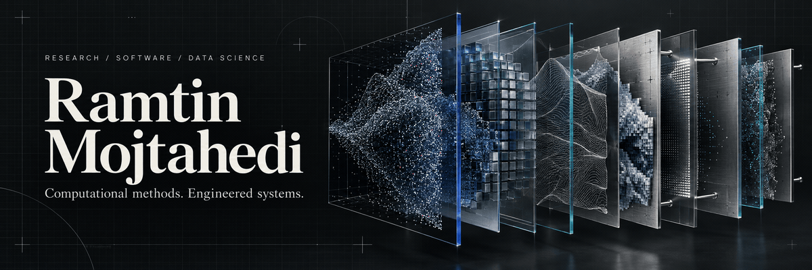
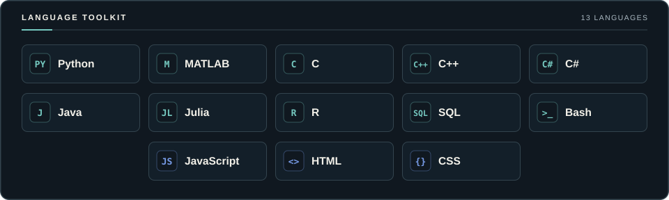
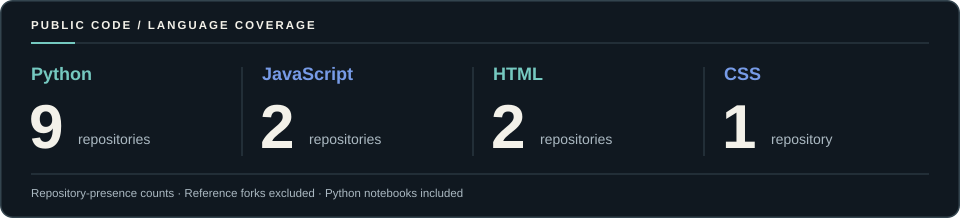

<a href="https://ramtin-mojtahedi.github.io/">
  <picture>
    <source media="(prefers-reduced-motion: reduce)" srcset="./assets/technology-header.png">
    
  </picture>
</a>

  
  
  
  
  
  

  <a href="./REPOSITORY_INDEX.md"><strong>Project directory</strong></a> &nbsp; / &nbsp;
  <a href="https://ramtin-mojtahedi.github.io/publications/"><strong>Publications</strong></a> &nbsp; / &nbsp;
  <a href="./LANGUAGE_USAGE.md"><strong>Language overview</strong></a>

## Research-minded. Engineering-driven.

I work across **scientific computing, data science, machine learning, and software development**—from computational imaging and analytical workflows to interactive websites and publication tools.

I hold a **Ph.D. in Computing from Queen's University** and am a **postdoctoral researcher at Toronto General Hospital, University Health Network, and the University of Toronto**. My current research explores multimodal prediction of lung-transplant outcomes.

## Explore the work

<table>
  <tr>
    <td width="50%" valign="top">
      
      
Web experiences, structured publication data, accessible interfaces, and automated validation.

      
<a href="https://github.com/Ramtin-Mojtahedi/Ramtin-Mojtahedi.github.io"><strong>Research portfolio &amp; publishing tools →</strong></a> <a href="https://github.com/Ramtin-Mojtahedi/natasha-singh-dental-site">Dental-profile website concept →</a>

    </td>
    <td width="50%" valign="top">
      
      
Feature analysis, statistical learning, model selection, and exploratory research notebooks.

      
<a href="https://github.com/Ramtin-Mojtahedi/AI-Radiomics-Carotid"><strong>Carotid radiomics &amp; cardiovascular risk →</strong></a> <a href="https://github.com/Ramtin-Mojtahedi/Assignment-4---Sentiment-Analysis">Sentiment analysis →</a>

    </td>
  </tr>
  <tr>
    <td width="50%" valign="top">
      
      
Image segmentation, representation learning, model adaptation, and learning from limited data.

      
<a href="https://github.com/Ramtin-Mojtahedi/peft-sam-liver-ct"><strong>SAM adaptation for liver CT →</strong></a> <a href="https://github.com/Ramtin-Mojtahedi/PEFT-FSL-MViT-LTS">LoRA &amp; few-shot learning →</a>

    </td>
    <td width="50%" valign="top">
      
      
Research papers, publication companions, methods, and technical writing.

      
<a href="https://ramtin-mojtahedi.github.io/publications/"><strong>Publication library →</strong></a> <a href="./REPOSITORY_INDEX.md#publications-and-reports">Technical reports &amp; paper companions →</a>

    </td>
  </tr>
  <tr>
    <td width="50%" valign="top">
      
      
Learning archives and collaborative analytical exercises, with their original context preserved.

      
<a href="https://github.com/Ramtin-Mojtahedi/Group_Share_Implementation"><strong>Model-selection coursework →</strong></a> <a href="./REPOSITORY_INDEX.md#coursework-and-learning">Coursework archive →</a>

    </td>
    <td width="50%" valign="top">
      
      
Simulation environments and model resources, with attribution to their upstream projects.

      
<a href="https://github.com/Ramtin-Mojtahedi/gazebo_models"><strong>Gazebo model collection →</strong></a> <a href="./REPOSITORY_INDEX.md#simulation-resources">Resource directory →</a>

    </td>
  </tr>
</table>

## Languages &amp; technologies

<picture>
  <source media="(max-width: 600px)" srcset="./assets/language-toolkit-mobile.svg">
  
</picture>

Research and analysis center on **Python**, with **PyTorch, MONAI, TensorFlow, pandas, scikit-learn, and XGBoost** appearing across the projects. **JavaScript, HTML, and CSS** support the web collection; the wider toolkit reflects the language experience listed in my [professional portfolio](https://ramtin-mojtahedi.github.io/).

### Public project footprint

<picture>
  <source media="(max-width: 600px)" srcset="./assets/language-footprint-mobile.svg">
  
</picture>

13 Python notebooks across six repositories. Counts include source files and verified notebook metadata, exclude reference forks, and describe public project coverage. [Sources and method →](./LANGUAGE_USAGE.md)

## Selected publications &amp; research code

| Work | Focus | Explore |
|---|---|---|
| **Foundation models · 2026** | Parameter-efficient adaptation for liver-tumour segmentation in CT | [Code](https://github.com/Ramtin-Mojtahedi/peft-sam-liver-ct) · [Paper](https://doi.org/10.1117/12.3087835) |
| **Radiomics · 2026** | Carotid ultrasound, clinical features, and cardiovascular outcomes | [Notebooks](https://github.com/Ramtin-Mojtahedi/AI-Radiomics-Carotid) · [Paper](https://doi.org/10.1016/j.ultrasmedbio.2026.05.006) |
| **Data-efficient learning · 2025** | LoRA and few-shot learning with Swin UNETR | [Notebooks](https://github.com/Ramtin-Mojtahedi/PEFT-FSL-MViT-LTS) · [Paper](https://doi.org/10.1117/12.3046253) |
| **Self-supervised learning · 2023** | Three-class liver-tumour classification from CT images | [Code](https://github.com/Ramtin-Mojtahedi/SimSiam-LiverCancer-CL) · [Paper](https://doi.org/10.1007/978-3-031-47425-5_28) |
| **Vision Transformers · 2022** | Patch-size research for liver-tumour segmentation | [Publication companion](https://github.com/Ramtin-Mojtahedi/OVTPS) · [Paper](https://doi.org/10.1007/978-3-031-18814-5_11) |

## The complete collection

**[27 public repositories, organized by purpose →](./REPOSITORY_INDEX.md)**

[Software](./REPOSITORY_INDEX.md#software-and-web-engineering) · [Data science](./REPOSITORY_INDEX.md#data-science-and-analysis) · [Imaging](./REPOSITORY_INDEX.md#computational-imaging) · [Publications](./REPOSITORY_INDEX.md#publications-and-reports) · [Coursework](./REPOSITORY_INDEX.md#coursework-and-learning) · [Simulation](./REPOSITORY_INDEX.md#simulation-resources)

---

<strong>Explore the work. Read the research. Get in touch.</strong> <a href="https://ramtin-mojtahedi.github.io/">Portfolio</a> · <a href="mailto:Ramtin.Mojtahedi@utoronto.ca">Ramtin.Mojtahedi@utoronto.ca</a>

