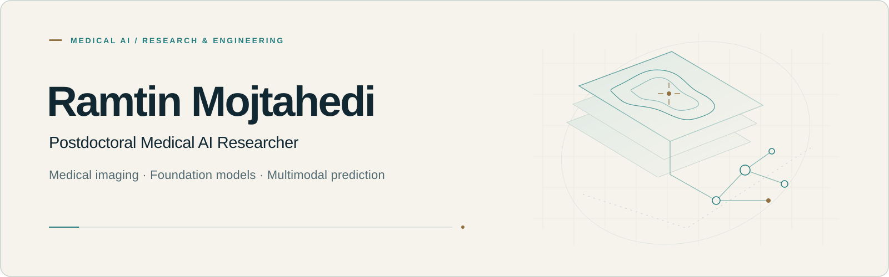
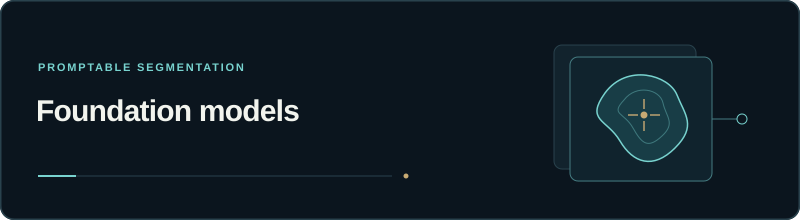
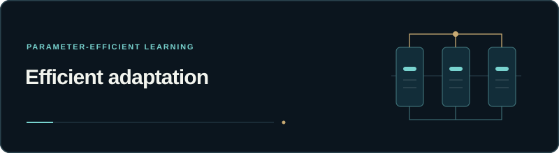
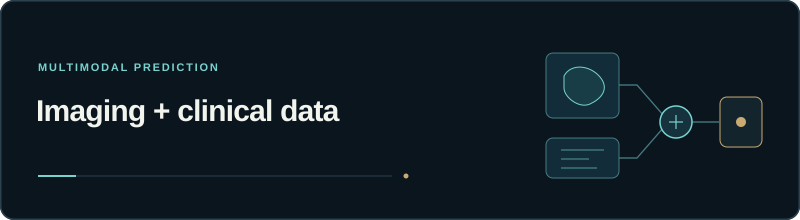
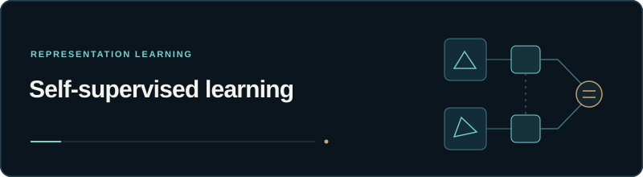

<picture>
  <source media="(prefers-color-scheme: dark)" srcset="./assets/research-banner-dark.svg">
  <source media="(prefers-color-scheme: light)" srcset="./assets/research-banner-light.svg">
  
</picture>

  <a href="https://ramtin-mojtahedi.github.io/"><strong>Portfolio</strong></a> &nbsp; / &nbsp;
  <a href="https://ramtin-mojtahedi.github.io/publications/"><strong>Publications</strong></a> &nbsp; / &nbsp;
  <a href="./REPOSITORY_INDEX.md"><strong>Project directory</strong></a> &nbsp; / &nbsp;
  <a href="https://ramtin-mojtahedi.github.io/#contact"><strong>Contact</strong></a>

## Medical AI, grounded in clinical questions

I am a **Postdoctoral Medical AI Researcher** at **Toronto General Hospital, University Health Network, and the University of Toronto**, with a Ph.D. in Computing from Queen's University.

My research connects **medical imaging**, **data-efficient learning**, and **multimodal clinical prediction**. Current work focuses on forecasting lung-transplant outcomes; my public research spans liver-tumour segmentation, self-supervised learning, and cardiovascular radiomics.

## Selected research

Four entry points into my research, with links to the code and corresponding publications.

<table>
  <tr>
    <td width="50%" valign="top">
      
      <h3><a href="https://github.com/Ramtin-Mojtahedi/peft-sam-liver-ct">SAM adaptation for liver CT</a></h3>
      
Parameter-efficient adaptation of SAM-family models for liver-tumour segmentation in CT.

      
<code>PyTorch</code> <code>MONAI</code> <code>PEFT</code>

      
<a href="https://github.com/Ramtin-Mojtahedi/peft-sam-liver-ct"><strong>Explore code →</strong></a> &nbsp; <a href="https://doi.org/10.1117/12.3087835">Paper ↗</a> Research snapshot · SPIE 2026

    </td>
    <td width="50%" valign="top">
      
      <h3><a href="https://github.com/Ramtin-Mojtahedi/PEFT-FSL-MViT-LTS">Learning with limited data</a></h3>
      
LoRA and few-shot learning with Swin UNETR for liver-tumour segmentation in CT.

      
<code>LoRA</code> <code>Swin UNETR</code> <code>Few-shot</code>

      
<a href="https://github.com/Ramtin-Mojtahedi/PEFT-FSL-MViT-LTS"><strong>Explore notebooks →</strong></a> &nbsp; <a href="https://doi.org/10.1117/12.3046253">Paper ↗</a> Research notebooks · SPIE 2025

    </td>
  </tr>
  <tr>
    <td width="50%" valign="top">
      
      <h3><a href="https://github.com/Ramtin-Mojtahedi/AI-Radiomics-Carotid">Carotid radiomics &amp; risk</a></h3>
      
Machine-learning analysis of carotid ultrasound radiomics, clinical features, and cardiovascular outcomes.

      
<code>Radiomics</code> <code>scikit-learn</code> <code>XGBoost</code>

      
<a href="https://github.com/Ramtin-Mojtahedi/AI-Radiomics-Carotid"><strong>Explore notebooks →</strong></a> &nbsp; <a href="https://doi.org/10.1016/j.ultrasmedbio.2026.05.006">Paper ↗</a> Research notebooks · Ultrasound in Medicine &amp; Biology 2026

    </td>
    <td width="50%" valign="top">
      
      <h3><a href="https://github.com/Ramtin-Mojtahedi/SimSiam-LiverCancer-CL">Liver-cancer representations</a></h3>
      
Self-supervised pretraining for three-class liver-tumour classification from CT images.

      
<code>TensorFlow</code> <code>SimSiam</code> <code>CNNs</code>

      
<a href="https://github.com/Ramtin-Mojtahedi/SimSiam-LiverCancer-CL"><strong>Explore code →</strong></a> &nbsp; <a href="https://doi.org/10.1007/978-3-031-47425-5_28">Paper ↗</a> Research snapshot · MICCAI Workshops 2023

    </td>
  </tr>
</table>

**Also explore:** [Vision Transformer patch-size research](https://github.com/Ramtin-Mojtahedi/OVTPS) · [CT tumour-classification notebook](https://github.com/Ramtin-Mojtahedi/Liver_Tumour_Recognition_and_Classification_with_Model-agnostic_Interpretable_Explanations) · [Research portfolio & publication tools](https://github.com/Ramtin-Mojtahedi/Ramtin-Mojtahedi.github.io)

Research repositories include archival code, notebooks, and publication companions. See each README for available data, dependencies, weights, licensing, and reproduction notes.

## Find your way around

| Collection | What you will find |
|---|---|
| [Medical AI research](./REPOSITORY_INDEX.md#medical-ai-research) | Five repositories covering segmentation, classification, and radiomics |
| [Vision transformers & references](./REPOSITORY_INDEX.md#vision-transformers-and-references) | Publication companions, patch-size studies, and upstream reference forks |
| [Web, engineering & challenges](./REPOSITORY_INDEX.md#web-engineering-and-challenges) | Research portfolio, web projects, workflow recognition, and technical documents |
| [Coursework & reports](./REPOSITORY_INDEX.md#coursework-and-learning) | Learning notebooks and an indexed collection of original intuition reports |

**[Browse all 27 public repositories →](./REPOSITORY_INDEX.md)**

## Methods & tools

| Research area | Methods and tools |
|---|---|
| **Medical image computing** | PyTorch · MONAI · SAM/MedSAM · Swin UNETR · CT & ultrasound |
| **Data-efficient learning** | LoRA · parameter-efficient fine-tuning · few-shot learning · SimSiam |
| **Clinical modelling** | Radiomics · scikit-learn · XGBoost · multimodal prediction |
| **Research engineering** | Python · NumPy · pandas · Jupyter · Git · scientific visualization |

---

  <strong>Research, publications, and professional background</strong> 
  <a href="https://ramtin-mojtahedi.github.io/">Website</a> ·
  <a href="https://scholar.google.com/citations?user=KjUrlGUAAAAJ&amp;hl=en">Google Scholar</a> ·
  <a href="https://orcid.org/0000-0002-3953-3256">ORCID</a> ·
  <a href="https://www.linkedin.com/in/ramtin-mojtahedi/">LinkedIn</a>

